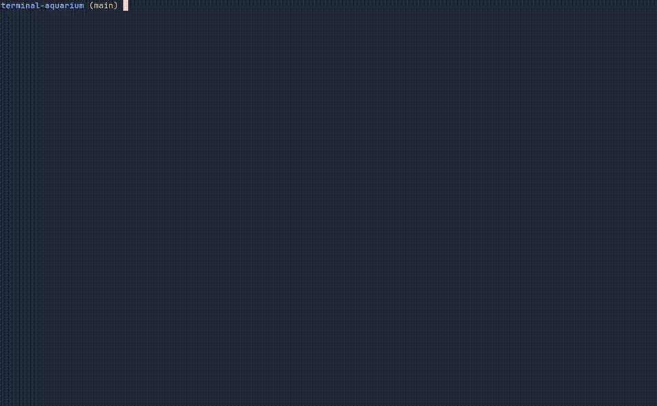
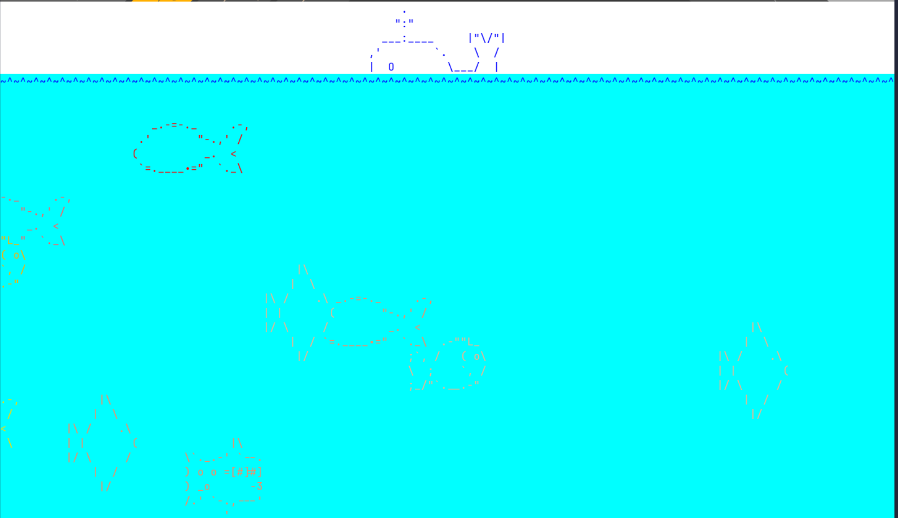
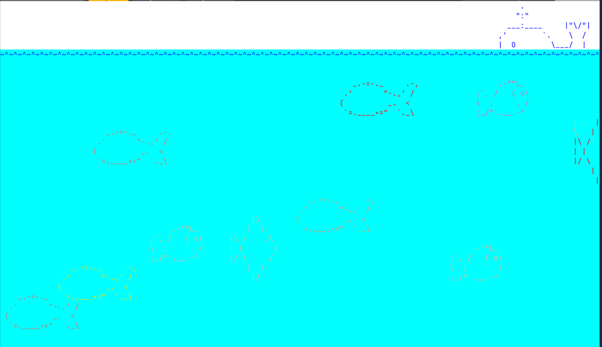

# terminal-aquarium

A animated aquarium for your terminal, written in Go using the [tcell library](https://github.com/gdamore/tcell).



## Installation

```bash
git clone https://github.com/arevbond/terminal-aquarium
cd terminal-aquarium
make run 

OR

go build .
./terminal-aquarium
```

## Screenshots


